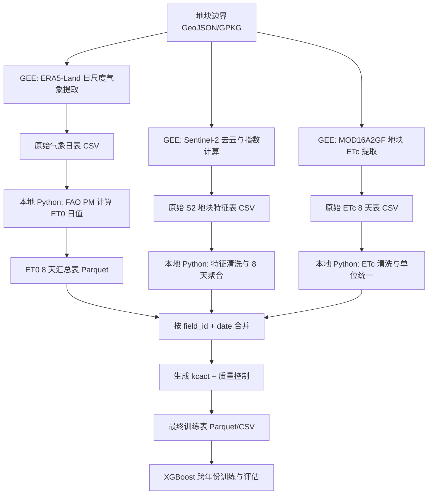

# MVP 数据流设计

## 1. MVP 范围

- 空间范围：河北省
- 作物：冬小麦
- 年份：`2021-2023`
- 样本单元：`field-date`
- 时间粒度：8 天窗口
- 标签定义：`kcact_8d = etc_8d_mm / et0_pm_8d_mm`

### 为什么先用 8 天粒度

这是首版最稳妥路线，因为：

- `MOD16A2GF` 天然是 8 天产品，适合作为统一 `ETc` 来源
- Sentinel-2 存在云和重访问题，8 天窗口能稳定聚合
- ET0 可先按日计算，再汇总到 8 天窗口，方法统一且容易追溯

## 2. MVP 推荐数据源

| 模块 | 数据源 | 用途 | 产出时间尺度 |
|---|---|---|---|
| 地块单元 | 外部 GeoJSON / GPKG | 样本空间单元 | 静态 |
| 行政边界 | GEE 内部边界数据或外部边界 | 河北掩膜 / 裁剪 | 静态 |
| 作物掩膜 | 外部冬小麦地块边界为主 | 保证单作物样本 | 季节/年度 |
| 遥感特征 | `COPERNICUS/S2_SR_HARMONIZED` | 植被指数与地块统计 | 8 天 |
| 云掩膜 | `COPERNICUS/S2_CLOUD_PROBABILITY` | S2 去云 | 单景 |
| 气象 | `ECMWF/ERA5_LAND/HOURLY` | ET0 所需驱动变量 | 日 |
| ETc 标签 | `MODIS/061/MOD16A2GF` | 实际蒸散发标签来源 | 8 天 |
| 静态因子 | Soil / DEM / Irrigation mask | 补充解释变量 | 静态 |

## 3. 总体数据流

## 4. 目录到数据流的映射

| 阶段 | 输入目录 | 输出目录 | 文件格式 |
|---|---|---|---|
| GEE 导出 | `data/external/` | `data/raw/gee/` | `csv` |
| ET0 计算 | `data/raw/gee/` | `data/interim/et0/` | `parquet` |
| 特征整理 | `data/raw/gee/` | `data/interim/features/` | `parquet` |
| 标签构建 | `data/interim/` | `data/processed/train/` | `parquet`, `csv` |
| 建模输出 | `data/processed/train/` | `outputs/models/`, `outputs/reports/`, `outputs/tables/` | `json`, `csv`, `txt`, `png` |

## 5. 每一步的输入 / 输出设计

### Step A. 地块边界准备

输入：

- `data/external/field_boundaries/hebei_winter_wheat_fields.geojson`

最少字段：

| 字段 | 类型 | 说明 |
|---|---|---|
| `field_id` | string | 地块唯一标识 |
| `province` | string | 省份，首版固定为 `Hebei` |
| `crop_type` | string | 固定为 `winter_wheat` |
| `season_year` | int，可选 | 若边界每年更新则保留 |

输出：

- GEE 可直接读取的资产或上传的表格资产

说明：

- 这是 MVP 的关键依赖。没有它，就无法真正做 `field-date` 样本。
- 如果暂时没有真实地块边界，可做备选：基于冬小麦分布区生成规则网格采样单元，但这应标记为技术验证版，而不是正式版。

### Step B. Sentinel-2 地块特征提取

输入：

- 地块边界资产
- `COPERNICUS/S2_SR_HARMONIZED`
- `COPERNICUS/S2_CLOUD_PROBABILITY`

处理：

- 时段限制到冬小麦生长季
- 去云、去阴影
- 计算地块内统计量
- 先以 8 天窗口聚合并输出

建议字段：

| 字段 | 说明 |
|---|---|
| `field_id` | 主键 |
| `date_start` | 8 天窗口起始日期 |
| `date_end` | 8 天窗口结束日期 |
| `date` | 与标签对齐的代表日期，先用 `date_end` |
| `year` | 年份 |
| `doy` | 年积日 |
| `obs_count_s2` | 窗口内有效观测数 |
| `cloud_free_ratio` | 有效像元占比 |
| `ndvi`, `evi`, `savi`, `gndvi`, `lswi`, `nirv` | 基础指数 |
| `re_ndvi`, `mndwi` | 可选红边/水分指数 |
| `lai_proxy` | 可选，先做代理量或后续补充 |

输出文件建议：

- `data/raw/gee/hebei_wheat_s2_field_8d_2021.csv`
- `data/raw/gee/hebei_wheat_s2_field_8d_2022.csv`
- `data/raw/gee/hebei_wheat_s2_field_8d_2023.csv`

### Step C. ERA5-Land 日尺度气象提取

输入：

- 地块边界资产
- `ECMWF/ERA5_LAND/HOURLY`

处理：

- 从小时尺度聚合为地块日尺度
- 为 ET0 计算准备必要气象变量

最少输出字段：

| 字段 | 说明 |
|---|---|
| `field_id` | 主键 |
| `date` | 日尺度日期 |
| `tmin_c` | 日最低温 |
| `tmax_c` | 日最高温 |
| `tmean_c` | 日平均温 |
| `dewpoint_c` 或 `rh_mean` | 湿度相关变量，二选一但必须统一 |
| `wind_2m_m_s` | 2m 风速 |
| `solar_rad_mj_m2_d` | 日总太阳辐射 |
| `precip_mm` | 日降水 |
| `pressure_kpa` | 可选，如需更严格 FAO PM |

输出文件建议：

- `data/raw/gee/hebei_wheat_era5_daily_2021.csv`
- `data/raw/gee/hebei_wheat_era5_daily_2022.csv`
- `data/raw/gee/hebei_wheat_era5_daily_2023.csv`

### Step D. MOD16A2GF 地块 ETc 提取

输入：

- 地块边界资产
- `MODIS/061/MOD16A2GF`

处理：

- 提取地块尺度 8 天 ET
- 统一换算到毫米

最少输出字段：

| 字段 | 说明 |
|---|---|
| `field_id` | 主键 |
| `date_start` | MOD16 窗口起始 |
| `date_end` | MOD16 窗口结束 |
| `date` | 对齐日期，先用 `date_end` |
| `etc_8d_mm` | 8 天 ETc，单位 mm |
| `qc_mod16` | 产品质量标识 |

输出文件建议：

- `data/raw/gee/hebei_wheat_mod16_etc_8d_2021.csv`
- `data/raw/gee/hebei_wheat_mod16_etc_8d_2022.csv`
- `data/raw/gee/hebei_wheat_mod16_etc_8d_2023.csv`

### Step E. 本地计算 ET0

输入：

- ERA5 日尺度表

处理：

- 用 FAO Penman-Monteith 计算 `et0_pm_mm`
- 再按 `field_id + 8d window` 汇总为 `et0_pm_8d_mm`

输出文件建议：

- `data/interim/et0/hebei_wheat_et0_daily_2021.parquet`
- `data/interim/et0/hebei_wheat_et0_8d_2021.parquet`

### Step F. 生成最终训练表

合并主键：

- `field_id`
- `date`

建议最终字段：

#### 基础标识

- `field_id`
- `date`
- `date_start`
- `date_end`
- `year`
- `doy`
- `province`
- `crop_type`

#### 遥感特征

- `ndvi`
- `evi`
- `savi`
- `gndvi`
- `lswi`
- `nirv`
- `re_ndvi`
- `obs_count_s2`
- `cloud_free_ratio`

#### 气象特征

- `tmean_c`
- `tmax_c`
- `tmin_c`
- `precip_mm_8d`
- `wind_2m_m_s_mean_8d`
- `rh_mean_8d` 或 `dewpoint_c_mean_8d`
- `solar_rad_mj_m2_d_sum_8d`
- `vpd_kpa_mean_8d`

#### 累积特征

- `precip_7d`
- `precip_15d`
- `precip_30d`
- `gdd_8d`
- `gdd_cum`
- `ndvi_lag1`
- `ndvi_mean_prev_3win`

#### 静态特征

- `soil_type`
- `elevation_m`
- `slope_deg`
- `irrigated_flag`

#### 标签

- `etc_8d_mm`
- `et0_pm_8d_mm`
- `kcact`

输出文件建议：

- `data/processed/train/hebei_winter_wheat_kcact_8d_2021_2023.parquet`
- `data/processed/train/hebei_winter_wheat_kcact_8d_2021_2023.csv`

## 6. 字段与单位规范

| 字段 | 单位 | 备注 |
|---|---|---|
| `tmin_c`, `tmax_c`, `tmean_c` | `degC` | 摄氏度 |
| `solar_rad_mj_m2_d` | `MJ m-2 d-1` | 日总辐射 |
| `precip_mm` | `mm` | 日降水 |
| `wind_2m_m_s` | `m s-1` | 2m 风速 |
| `etc_8d_mm` | `mm / 8d` | MOD16 统一后 |
| `et0_pm_8d_mm` | `mm / 8d` | 日 ET0 汇总 |
| `kcact` | 无量纲 | `etc_8d_mm / et0_pm_8d_mm` |

## 7. 质量控制规则

首版建议最少做这些过滤：

- `et0_pm_8d_mm <= 0` 的样本直接剔除
- `etc_8d_mm < 0` 的样本剔除
- `kcact <= 0` 的样本剔除
- `kcact > 2.0` 先标为异常，默认剔除
- `obs_count_s2 < 1` 的 8 天窗口剔除
- `cloud_free_ratio < 0.3` 的样本先标记低质量
- 冬小麦生长季之外的窗口先不纳入 MVP

## 8. 跨年份验证设计

MVP 不做随机切分，先固定成：

- Train: `2021 + 2022`
- Test: `2023`

后续可扩展为轮换：

1. Train `2021 + 2022`, Test `2023`
2. Train `2021 + 2023`, Test `2022`
3. Train `2022 + 2023`, Test `2021`

## 9. 当前最关键的缺口

以下内容需要优先补齐，否则后续代码无法真正跑通：

1. 河北冬小麦地块边界或等价采样单元
2. 冬小麦生长季时间窗的明确配置
3. 是否需要在 2021-2023 每年使用独立地块图层
4. 静态特征数据源是否已具备

在这些数据未补齐前，GEE 和 Python 脚本可以先按约定接口开发，但正式样本表只能先做到技术验证版。
